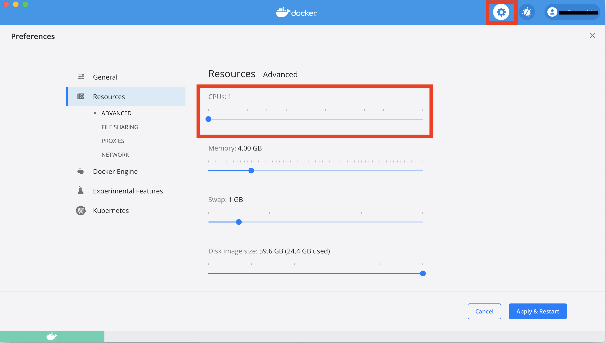

```{r setup, include=FALSE}
knitr::opts_chunk$set(echo = FALSE, message = FALSE, warning = FALSE)
```

```{r}
library(knitr)
library(kableExtra)
library(dplyr)
```


### A Docker container to anonymize/recode STS (Society of Thoracic Surgeons) data

Michael Wagner
Division of Biomedical Informatics
Cincinnati Children's Hospital Medical Center
September, 2022

Hanh Trang Do
Division of Behavioral Med-Clin Psychology
Cincinnati Children's Hospital Medical Center
August, 2024

based on a previous version of code by 

Jason Homsy, M.D., Ph.D. and Marko Boskovski, M.D.
Seidman Lab, Dept. of Genetics, Harvard Medical School


## Introduction
The STS docker container is used to create a subset of an STS data and remove unwanted columns (e.g., those with PHI or other sensitive data) for a list of cases.

After installation, the software runs on a local computer without requiring an internet connection, thus maintaining the security and privacy of the participant information. 

## Requirements
* Operating System:
    + MacOS
    + Windows
* RAM: 8GB
* Disk Space: 20GB (docker container is 10GB)
* administrator privileges (initially only, to install the 'docker' software)

## Step 0: Install Docker

See the [Installing Docker](https://degauss.org/using_degauss.html#Installing_Docker) webpage.

**_Note about Docker Settings:_**  
After installing Docker, but before running containers, go to **Docker Settings > Advanced** and change **memory** to greater than 4000 MB (or 4 GiB) <br> 

\begin{center}
\includegraphics[width=0.75\textwidth]{../figs/docker_settings_memory.png}
\end{center}

<!-- <center>  </center> -->
<br> If you are using a Windows computer, also set **CPUs** to 1. <br>
<!-- <center>  </center> Click **Apply** and wait for Docker to restart. -->

## Step 1: Running the STS container

The command to process it through the STS container is:
 
  - macOS:
  
    ```sh
    docker run --rm -v $PWD:/tmp ghcr.io/pcgcid/sts:latest \
    [--data <data.file>] [--cases <case.file>] [--remove <columns-remove>] \
    [-h | --help] [--zip-output-tables]
    ```
  
  - Windows (CMD):
  
    ```sh
    docker run --rm -v "%cd%":/tmp ghcr.io/pcgcid/sts:latest ^
    [--data <data.file>] [--cases <case.file>] [--remove <columns-remove>] ^
    [-h | --help] [--zip-output-tables]
    ```
    
For example, the following command can be used to create a subset of an STS data stored in 'STS.datafile.txt' and remove unwanted columns (e.g., those with PHI or other sensitive data) for a list of cases stored in 'list.of.cases.txt':
  
  - macOS:
  
    ```sh
    docker run --rm -v $PWD:/tmp ghcr.io/pcgcid/sts:latest \
    --data STS.datafile.txt --cases list.of.cases.txt --remove "PHI1,PHI2"
    ```
  
  - Windows (CMD):
  
    ```sh
    docker run --rm -v "%cd%":/tmp ghcr.io/pcgcid/sts:latest ^
    --data STS.datafile.txt --cases list.of.cases.txt
    ```

The container will output different files for each table in the STS data file, containing the STS data for the cases in the list. The output files will be stored in the current directory. 

For example, if the input data contains the following tables: `Demographics`, `Operations`, `NCAbnormality`, `NCAA`, `Syndromes`, `ChromAbnormalities`, `PreopFactors`, `Diagnosis`, `Procedures`, `Complications`, the output files will be named `Demographics.txt`, `Operations.txt`, `NCAbnormality.txt`, `NCAA.txt`, `Syndromes.txt`, `ChromAbnormalities.txt`, `PreopFactors.txt`, `Diagnosis.txt`, `Procedures.txt`, `Complications.txt` respectively. If `--zip-output-tables` was used, the output files will be zipped into a file called `STS_tables.zip`.

## Parameters

Command line parameters to show help:

- `-h` or `--help`: Show available parameters. For example, users can use this command:

  ```sh
  docker run  ghcr.io/pcgcid/sts:latest -h
  ```
or 

  ```sh
  docker run  ghcr.io/pcgcid/sts:latest --help
  ```

This container __requires__ both of the following arguments:

- `--data` to specify a flat '|'-separated text file of the site's STS data containing concatenated tables, each table separated by a table name of the format ***tablename
- `--cases` to specify a flat, tab-delimited file with exactly two columns, 
      MEDRECN PCGC.BLINDED.ID

This container takes the following optional arguments:

-   `--remove` (optional flag) to remove columns from the output file. The columns to remove (in addition to default columns) should be listed in a comma-separated list following the --remove flag. Default columns to remove:
    - MEDRECN, PATFNAME, PATID, PATLNAME, PATMNAME,PATPOSTALCODE, PATREGION, BIRTHCIT, BIRTHSTA, HOSPNAME, HOSPNPI, HOSPID, HOSPZIP, HOSPSTAT, SURGEON, SURGEONID, SURGNPI, TIN, ASSTSURGEON, ASSTSURGNPI, ASSTSURGEONID,HICNUMBER, PATMINIT, PATCOUNTRY,MATNAMEKNOWN, MATSSNKNOWN, MATLNAME, MATFNAME, MATMINIT, MATMNAME, MATSSN, PARTICID, VENDORID, CNSLTATTND, CNSLTATTNDID, ATTENDSURG, SURGEON,SURGEONID, SURGNPI, ASSTSURGEON, ASSTSURGEONID, ASSTSURGNPI, RESIDENT, RESIDENTID, HOSPZIP, HOSPNPI, REFCARD, REFPHYS, HANDOFFANESTH, HANDOFFSURG, HANDOFFPHYSSTAFF, HANDOFFNURSING, PRIMANESNAME, PRIMANESNPI, SECANES, SECANESNAME, CRNA, CRNANAME, NONCVPHYS, FELRES

> For example, to remove columns named 'PHI1' and 'PHI2' in addition to default columns, use the following syntax:
        --remove "PHI1,PHI2"
        
-   `--zip-output-tables` (optional flag) to have tab delimited output files 
      zipped into a file called STS_tables.zip (Mac or Linux only)        

## Running the R script

- This R script can be used to create a subset of an STS data submission and remove unwanted columns (e.g., those with PHI or other sensitive data). The basic syntax is as follows:

  ```sh
  Rscript filter-STS.R [--data <data.file>] [--cases <case.file>] [--remove <columns-remove>] [-h | --help] [--zip-output-tables]
  ```    

- For example, the following command can be used to create a subset of an STS data stored in 'STS.datafile.txt' and remove unwanted columns (e.g., those with PHI or other sensitive data) for a list of cases stored in 'list.of.cases.txt':

  ```sh
  Rscript filter-STS.R  --data STS.datafile.txt --cases list.of.cases.txt [--zip-output-tables -help --remove <columns-remove>]
  ```

The arguments are the same as for the Docker container. For detailed instructions, see [Parameters](#parameters).

For R script, run script, install packages if missing. Run again. Examine output (check for PHI in output and do other sanity checks.
